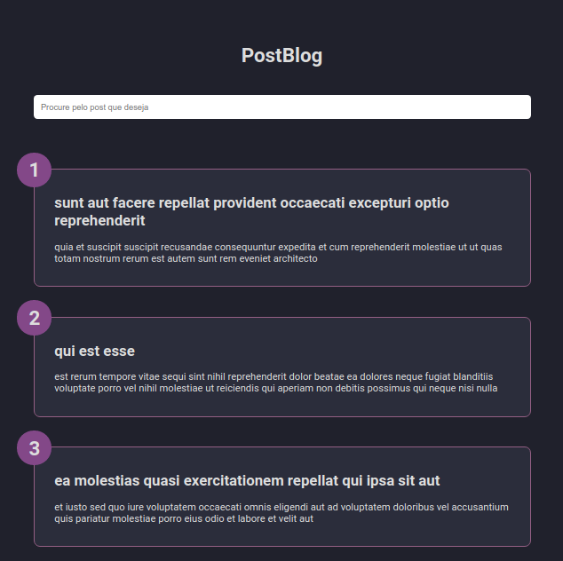

# PostBlog

Aplicação Web para treino prático de REST API. Desenvolvido com JavaScript puro, tem a função de listar posts retirados da API disponibilizada pelo <a href="https://jsonplaceholder.typicode.com">JSON Placeholder</a>. 

  

## Features para implementação

- [x] **Scroll Infinito**
- [ ] **Sistema de busca**

